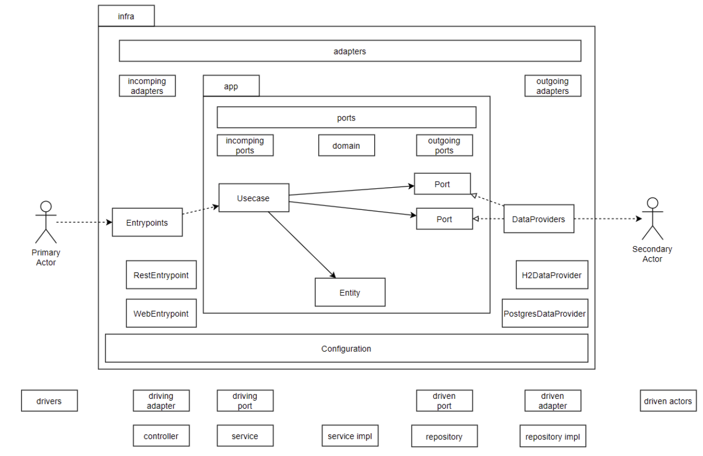

## What it is

Ports and Adapters architecture(or more known as hexagonal architecture) is implemented. Tried to follow philosophy of 'Real Life Clean Architecture(RLCA)' of matter-battiston in Go lang, and make our 'Uncle Bob' proud again.

It is not classical layered architecture. Compared to RLCA, I put more focus on actors, and explicitly 


## Why I made this

There are two quotes that I like from Clean Architecutre.

> The center of your application is not the database. Nor is it one or more of the frameworks you may be using. **The center of your application is the use cases of your application** - *Unclebob* ([source](https://blog.8thlight.com/uncle-bob/2012/05/15/NODB.html))

> The Single Responsibility Principle (SRP) states that each software module should have one and only one reason to change - *Unclebob* ([source](https://blog.cleancoder.com/uncle-bob/2014/05/08/SingleReponsibilityPrinciple.html))

When I was studying implementations of clean architectures written with golang, I thought actor and usecase need more emphasis , and need to 'scream more'. And stacking up entity to service, using same name again and again from entity to service or controller, is better to be avoided, and I thought we should more focus on SRP. Maybe I'm a bit presumptuous for noob gopher, but that was my take.


## Port and Adapter approach



Above depictes the hexagonal architecture and comparison on classical layered clean architecture.

* Incoming port, Outgoing port
  * They are 'sockets' that incoming adapter and outgoing adapter relies on.
  * Not the other way around.
* Alias
  * incoming port --> Usecase
  * outgoing port --> Port
  * incoming adapter --> Entrypoint
  * outgoing adapter --> DataProvider
* Intended to follow hexagonal architecture(port and adapter architecture)'s terminology and avoid terminology of classical layered clean architecture.
* Usecase interactor is incoming ports. Ports are outgoing ports.


## Folder structure

* /internal
  * core --> core layer of clean architecture
    * entity --> domain models
    * usecase --> (ports) service interactors and port declarations
  * infra --> outter layer of clean architecture
    * configuration --> configures objects
    * dataprovider --> (outgoing adapter) connects to DB. implements Ports
    * entrypoint --> (incoming adapter) controllers(web, rest, ws ...), routers


## To run

``` bash
go run .
```

After project is started, access these links, and it will show some results, if test.db sqlite has some data in it.

http://localhost:8000/

http://localhost:8000/api/customer/ordering/foodmenus

http://localhost:8000/api/customer/ordering/foodmenu/Big%20mac

No unit test or integration test is implemented yet.


## Project status

As of 29 Dec 2020, this project is underdeveloped. 

Even thouhg I developed this with glamorous ambition, it turns out to be this RLCA concept is a bit too clumsy for golang implementation when it comes to adding new features. Maybe if I could find good DI/IoC framework for golang(It was vaible using Spring with Java), then it could be viable dream. 

This problems stems from over-abstraction(mainly in controllers), and golang's name overlapping. As project grows, names overlaps. While RLCA in java was causing not much of problems, in golang, it is. In java, function names were layers of member methods, class, package, and finally, gradle/maven module. But in golang, it is layers of function, pacakge, and - maybe I could segragate things with /pkg, but i think that won't solve my problem completely - thats all.

I will search for more clean architecture implementation, and decide to continue this effort or not.


## Future plan

* Integration test needed for all usecase ports
* Web front needed
* Maybe I will be able to implement CQRS - all data access command is managed by ports, and direct interface is hidden from usecase user, so it is viable dream(or I dream too much!)


## References

Real Life Clean Architecture [GIT](https://github.com/mattia-battiston/clean-architecture-example) [PPT](https://www.slideshare.net/mattiabattiston/real-life-clean-architecture-61242830)

Clean architecture series - Part1 (Hexagonal architecture) [ARTICLE](https://dev.to/pereiren/clean-architecture-series-part-1-m64)

Golang / Go Crash Course 03 | Implementing Clean Architecture principles in our REST API [VIDEO](https://www.youtube.com/watch?v=Yg_ae0UvCv4&t=2527s)


## License

"THE SUSHI-WARE LICENSE"

<sikbrad@gmail.com> wrote this file.

As long as you retain this notice you can do whatever you want
with this stuff. If we meet some day, and you think this stuff
is worth it, you can buy me a **sushi 🍣** in return.

This license is based on ["THE BEER-WARE LICENSE" (Revision 42)]